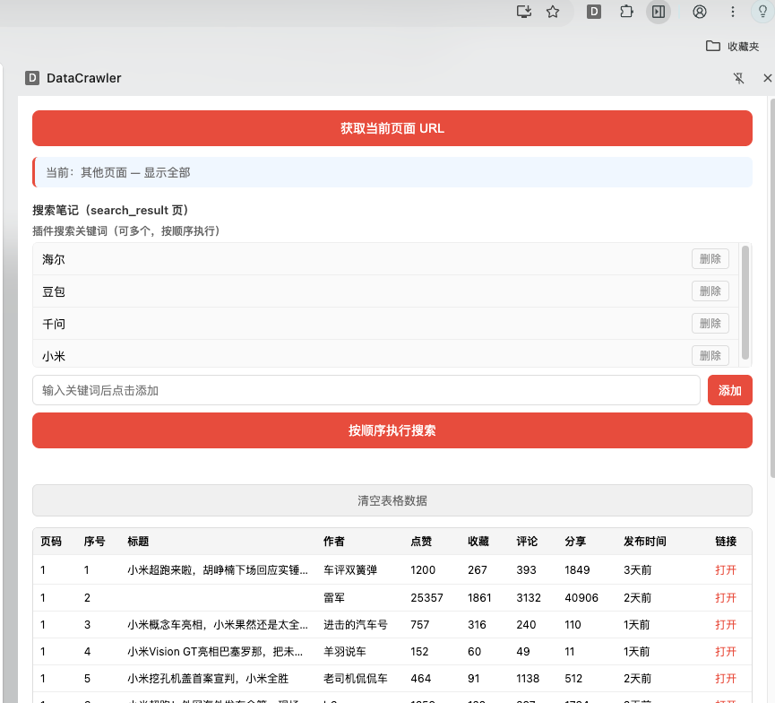
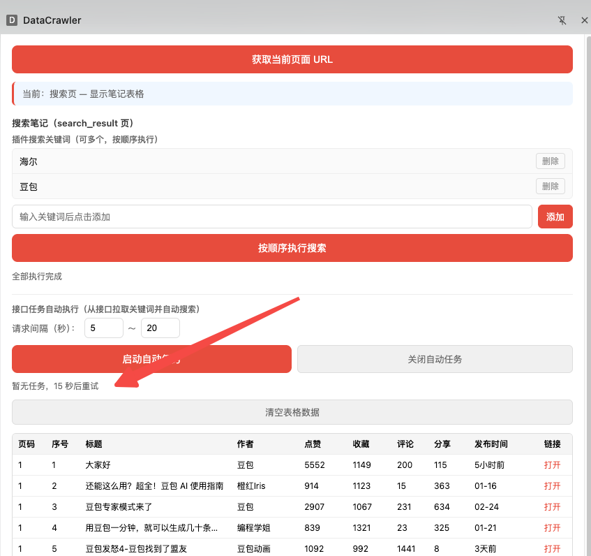
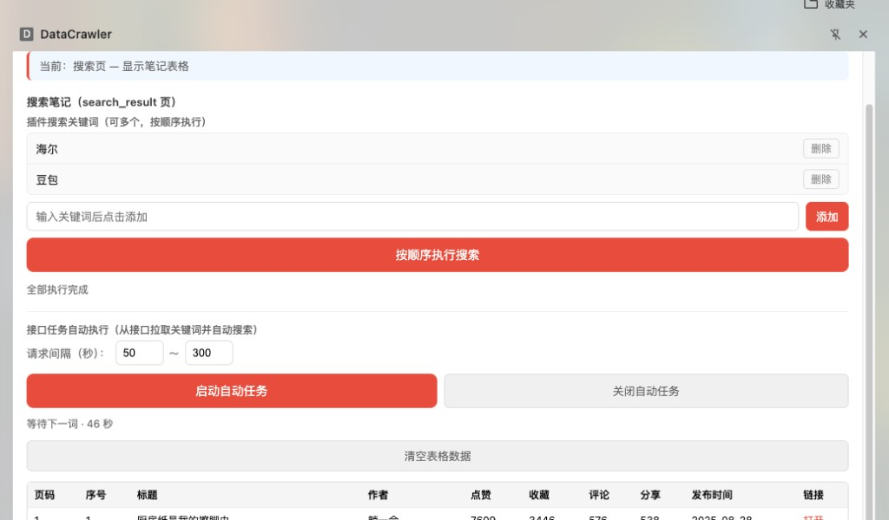
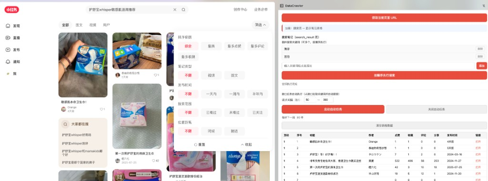
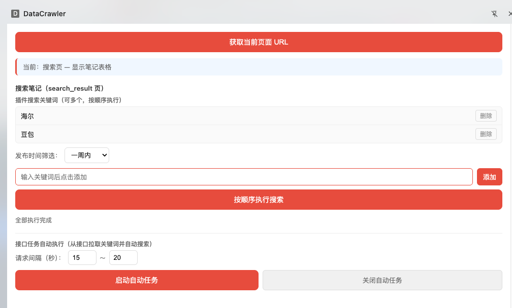
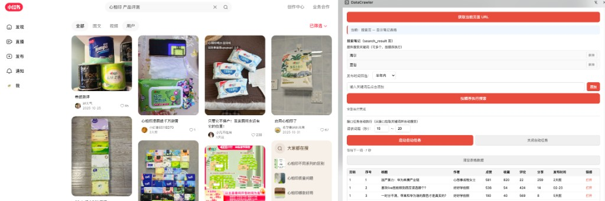

# 提示词记录 — 2026-03-04

## 会话 1: 自动任务与发布时间筛选 (19:52~14:49)

1. `19:52` https://cbd-front-itomms.smzdm.com/elice/xhs_extension/get_keyword_task?trace_id=20250303 

这个接口可以获取搜索的返回值, 想通过这个接口获取关键词任务, 然后自动执行小红书笔记搜索任务, 两个任务之间请求间隔可以设置成动态变动,比如5秒-20秒请求间隔;
需要有个按钮执行这个从接口获取任务执行的启动按钮和关闭按钮,同时保留现有的安顺序执行的逻辑;

请帮我在浏览器插件中自行设计并完善上述功能

   

2. `≈19:58` https://cbd-front-itomms.smzdm.com/elice/xhs_extension/get_keyword_task?trace_id=20260303 

链接发错了

3. `≈20:04` 点击启动任务按钮没有反应

4. `≈20:10` 点击启动按钮后 再点击按顺序执行按钮就实效了

5. `20:16` 启动任务按钮 点击后无效果

   

6. `≈21:49` 点击启动自动按钮  时候 弹出测试alert 我看下执行代码的地方

7. `≈23:22` 获取任务的时候,怎么没有执行:

https://cbd-front-itomms.smzdm.com/elice/xhs_extension/get_keyword_task?trace_id=20260303

8. `≈00:55` 没执行啊 ,什么啊 ,在点击 启动自动任务按钮时候 启动这个请求吧

https://cbd-front-itomms.smzdm.com/elice/xhs_extension/get_keyword_task?trace_id=20260303  直接返回给我这个请求的源码到 提示框,我要验证

9. `≈02:28` 现在j接口调通了, 现在 @search_keyword.txt 返回接口,请条通自动化搜索网页后续流程

10. `04:01` 请求间隔, 设置后 ,持久化浏览器里面

   

11. `≈04:05` 将前面所有修改历史记录到md

12. `04:09` 搜索的时候发布时间选择半年内好做吗?

   

13. `≈08:59` 记录md

14. `13:50` 点击按顺序执行的时候 第一个关键词海尔 半年内筛选并没有生效

   

15. `≈14:01` 应用内筛选都不生效了

16. `≈14:12` 发布时间筛选

按顺序执行搜索和启动自动任务搜索按钮都没有生效

17. `14:23` 启动自动任务 按钮 操作的时候为啥关键词一次筛选一次不筛选

   

18. `≈14:27` 请每次搜索都走发布时间筛选策略

19. `≈14:30` PUBLISH_TIME_FILTER_DELAY_MS 这个不需要了
逻辑改成:  搜索完成  → 点发布时间筛选

20. `≈14:33` 好像不行不等待的话筛选没生效

21. `≈14:36` 如果改成自动判断是否加载完成的逻辑呢?

22. `≈14:39` 记录md

23. `≈14:43` 启动自动任务按钮 也适配 按顺序执行搜索逻辑

24. `≈14:46` 更细md

25. `≈14:49` 两个按钮执行搜索的时候别忘了下方表格加载
