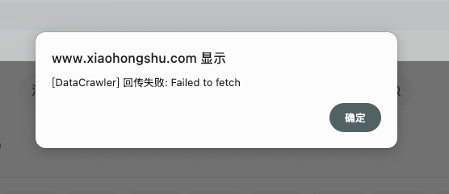
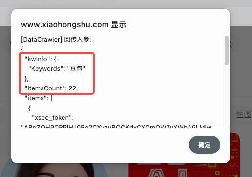
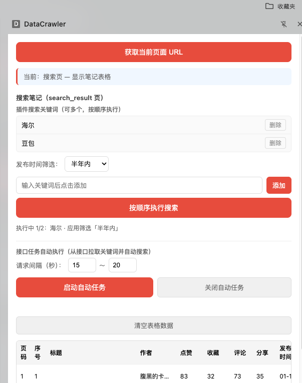
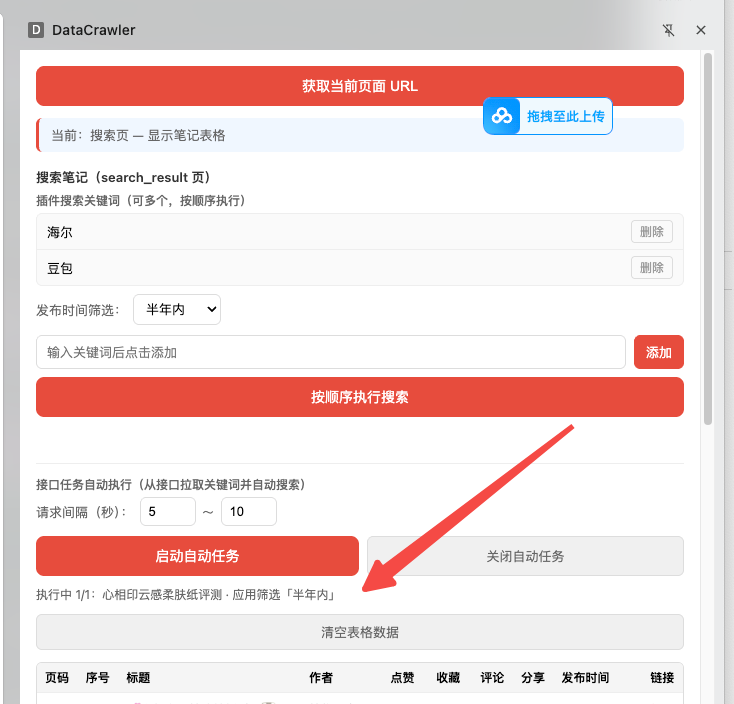

# 提示词记录 — 2026-03-06

## 会话 1: 数据回传接口对接 (11:13~14:49)

1. `≈11:13` 我数据回传接口已经开发完了, python调用代码如下:
@script/xhs_extension_spider.py 

请改成js调用方式,并再每次小红书拦截搜索数据包的时候回传数据

注意get_keyword_task是获取搜索数据结果, 目前插件已经获取了,但是要拼接拦截的接口, 要求在每次拦截后发送数据回传,发送后打印alert日志

2. `≈11:22` 开始执行上面计划

3. `11:31` 数据回传失败了,请alert打印回传入参

   

4. `≈11:38` 入参错了, 应该是,我给你案例:

@data/xhs/data_back.txt

5. `11:45` 入参标红的地方还是不对应该使用完整的任务获取数据替换

   

6. `12:00` 不对哦, 获取任务接口之前已经实现了,就是启动自动任务时候获取的,
哦 对了,只有再点击启动自动任务的时候才发送回传请求

   

7. `≈13:24` 请求如参不要kwInfo

8. `14:47` 回传成功或者失败,不要alert了 在页面 展示吧

   

## 会话 2: Chrome 商店发布咨询 (21:59~22:17)

1. `≈21:59` 问你下,如果这个插件发布到chrome商店能通过审核吗?

2. `≈22:03` 我如果想上传商店应该如何修改

3. `≈22:06` 如果将回传地址让用户自行输入而不写到插件代码可以吗?

4. `≈22:10` 也就是如果我必须要做数据回传就不能依赖商店了,只能通过未上架分发?

5. `≈22:13` 那么如果使用未上架分发, 我插件更新了如何通知客户?

6. `≈22:17` 再想想我要是需要数据回传而且要使用应用商店,有没有其他办法通过审核
