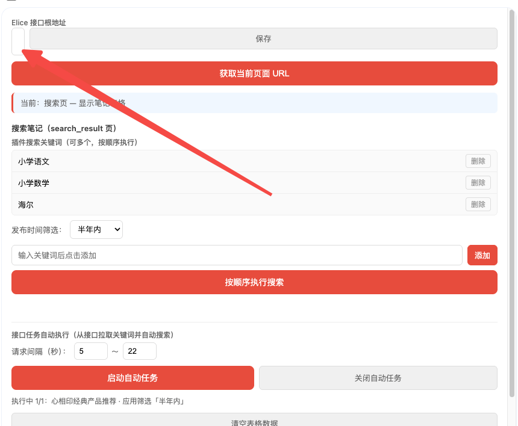

# 提示词记录 — 2026-03-07

## 会话 1: 域名兼容与配置化 (01:28~02:42)

1. `≈01:28` 小红书域名:

支持拦截https://www.rednote.com/  等同于 https://www.xiaohongshu.com/explore

2. `≈01:36` 同时https://edith.xiaohongshu.com  搜索接口?的拦截也替换成:

https://webapi.rednote.com/api/sns/web/v1/search/notes

3. `≈01:44` 不是替换而是兼容

4. `≈01:51` 记录md

5. `≈01:59` var ELICE_HOST = 'https://cbd-front-itomms.smzdm.com/';

这个参数配置成浏览器插件可以配置的选项, 并存储到浏览器缓存起来

6. `≈02:07` 记录md

7. `02:14` 排版有问题

   

8. `≈02:20` 更新md了吗

9. `≈02:25` @js 删除js文件中的所有 cbd-front-itomms.smzdm.com 的域名 值, 还要保证整个逻辑正常

10. `≈02:31` 如果把插件打包成chrome浏览器插件文件执行什么命令

11. `≈02:37` 帮我写个脚本,打包成crx和zip的命令脚本

12. `≈02:42` 帮我把插件打包

## 会话 2: 打包与安全清理 (02:50~03:36)

1. `≈02:50` crx如何安装到chrome

2. `≈02:54` 重新打包

3. `≈02:58` script 和data目录不参与打包

4. `≈03:02` 重新打包

5. `≈03:07` 记录md

6. `≈03:11` md也不要打包

7. `≈03:15` 重新打包

8. `≈03:19` 问你下 插件的js可以做混淆吗/

9. `≈03:24` 好你执行吧

10. `≈03:28` 重新打包

11. `≈03:32` https://cbd-front-itomms.smzdm.com/  是敏感信息不能出现在任何文件中

12. `≈03:36` elice 也不要保留
