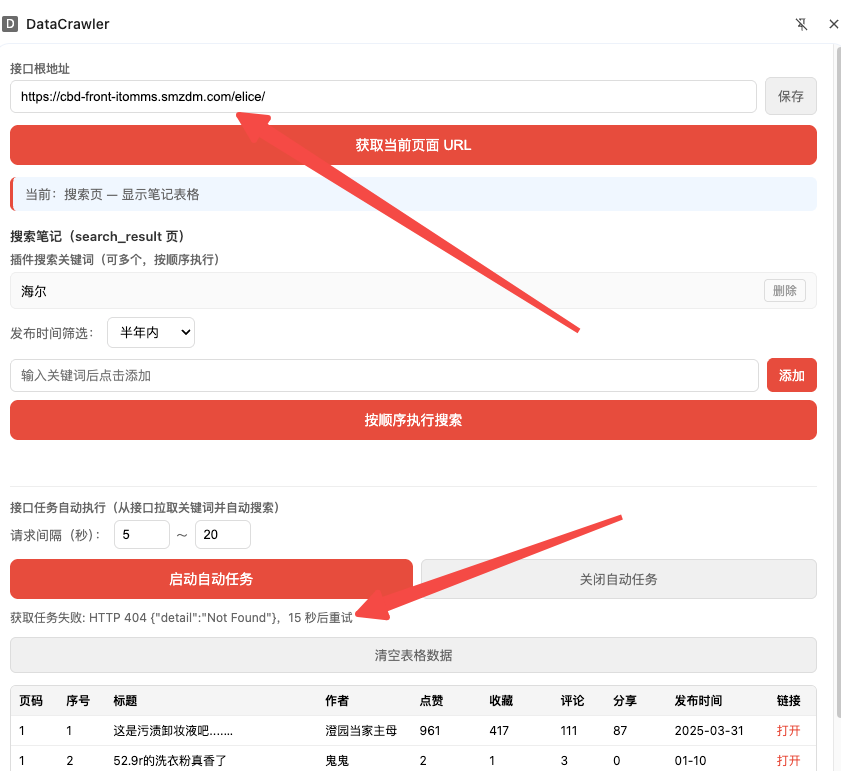
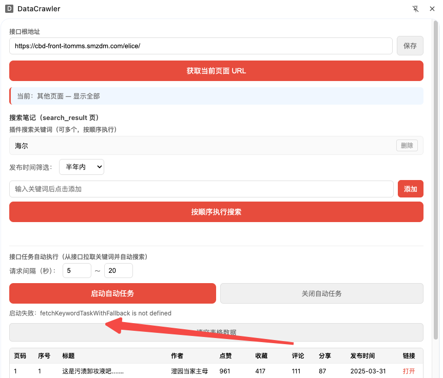
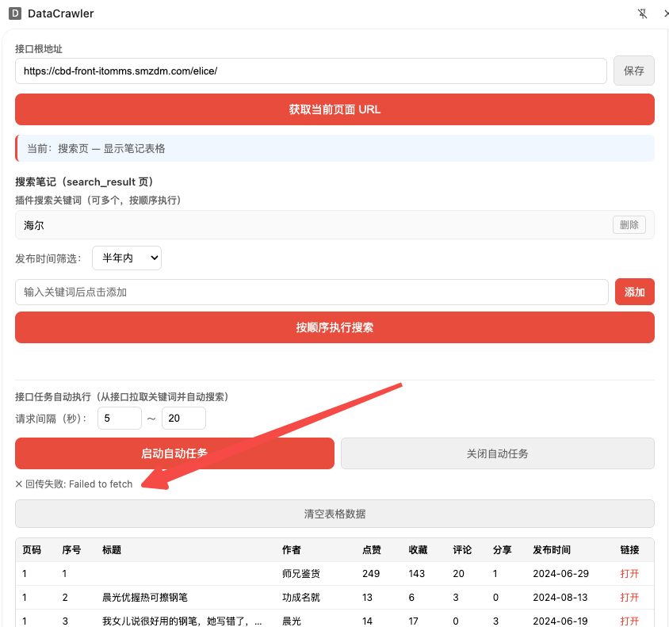
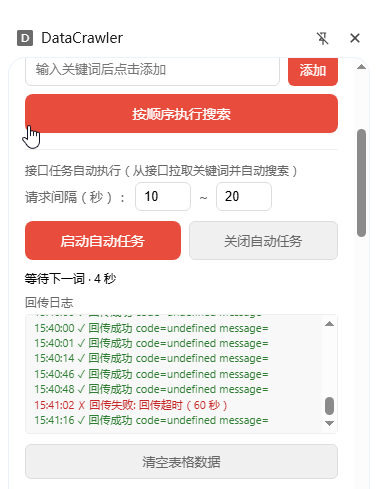
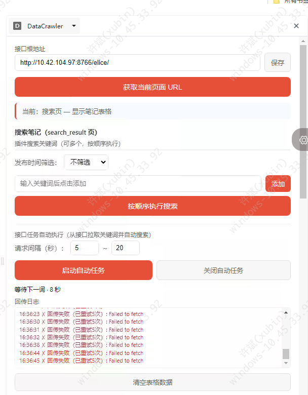

# 提示词记录 — 2026-03-09

## 会话 1: 线上调试与部署优化 (03:38~10:41)

1. `≈03:38` 重新打包

2. `03:44` 报错了?

   

3. `≈03:46` https://cbd-front-itomms.smzdm.com/elice/xhs_extension/get_keyword_task?trace_id=20260303  刚才截图是url异常导致 真正的获取任务是 https://cbd-front-itomms.smzdm.com/elice/xhs_extension/get_keyword_task?trace_id=20260303

4. `03:48` 报错了

   

5. `03:51` 回传信息异常估计也是url问题

   

6. `≈06:13` 数据回传的日志怎么没有了

7. `≈08:36` 重新打包

8. `≈10:58` 回传接口的超时时间设置成60秒

9. `≈13:20` 提交到github

10. `15:43` 数据回传超时时或者失败时候,重试5次,并记录重试次数

   

11. `≈16:10` 重新打包

12. `16:37` 线上 报错修复

   

13. `≈03:08` 重新打包

14. `≈13:39` 现在浏览器插件部署到云window主机了,但是已关闭连接后 云手机的浏览器就不执行了或者分辨率变化了导致浏览器插件实效

15. `≈00:10` 腾讯云

16. `≈10:41` 如何让插件中js, 即使浏览器最小化&失去焦点也可以执行?
