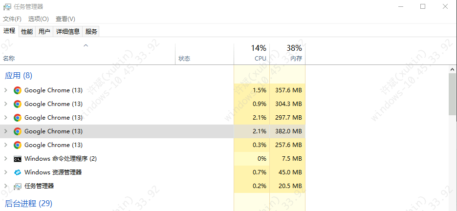
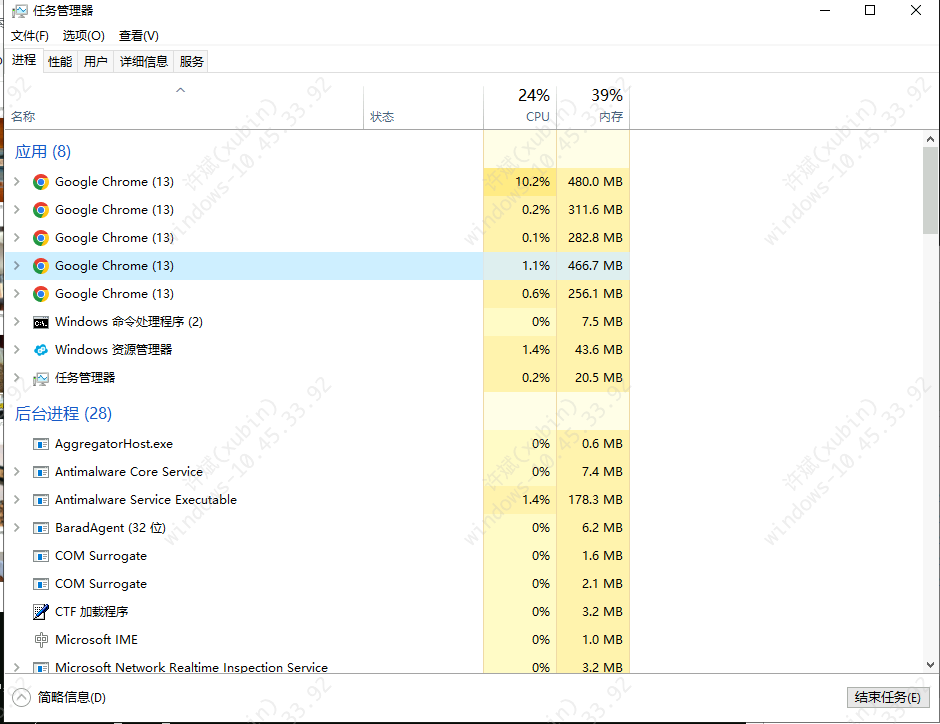

# 提示词记录 — 2026-03-10

## 会话 1: 内存优化与运维问题排查 (10:12~11:18)

1. `≈10:12` 帮我检查下当前插件有没有内存溢出

2. `≈10:17` 如何修改

3. `≈10:22` 这个内容好像一直增长

4. `≈10:27` 每次拦截的时候会最加这个数组

5. `≈10:32` 修复这个每次拦截后数组都增加情况

6. `≈10:37` 目前如果内存有无限增长内容导致js内存溢出则修复

7. `≈10:42` 再检查逻辑有没有问题

8. `≈10:47` 打包

9. `≈10:52` 打包

10. `10:57` chrome运行一段时间内存一直增加,如何优化这个内存占用

   
   

11. `≈11:01` 也就是插件代码无需修改吗? 能主动清理内存吗?

12. `≈11:05` chrome 有办法启动的时候打开插件吗?

13. `≈11:09` 我有什么办法, 例如使用sekir服务可以实现自动打开插件吗?

14. `≈11:13` chrome 里面占用最大内存的程序杀死后, 浏览器出现崩溃程序,这时候内存降下来了,是什么原因? 并且浏览器插件定时任务停止了,提示已关闭

15. `≈11:18` 能否通过js实现这个降低内存的方法?
