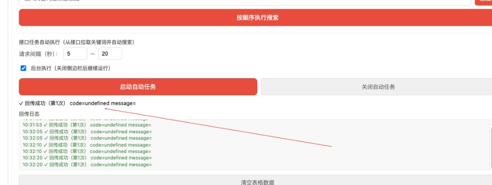
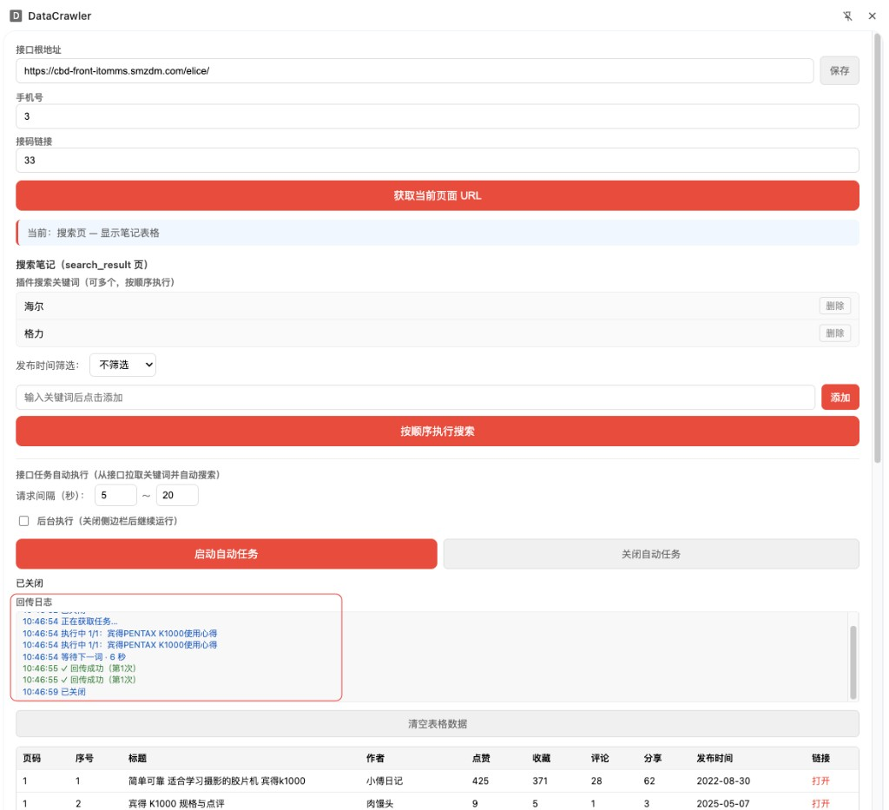
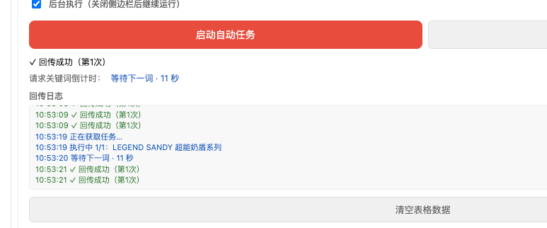
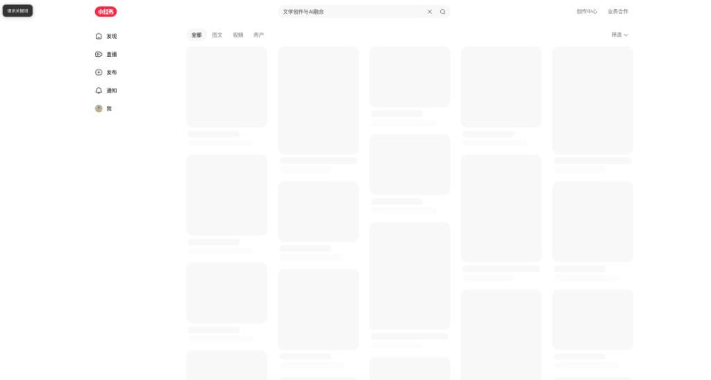
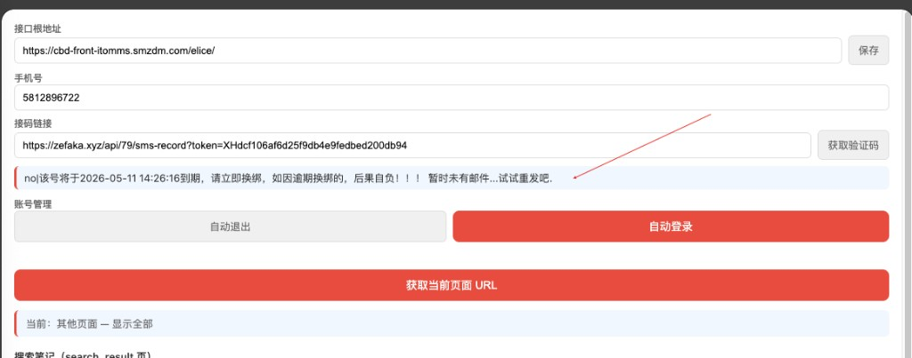
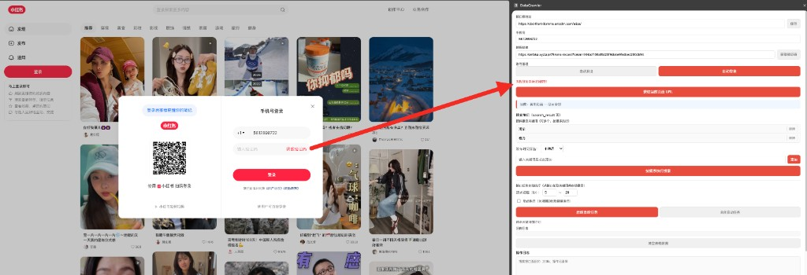
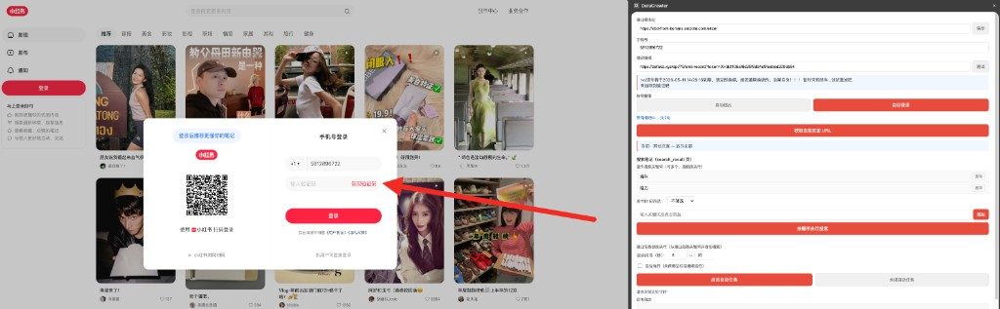
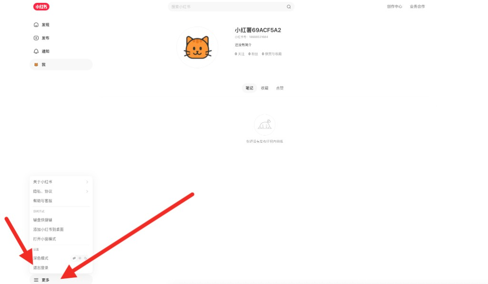

# 提示词记录 — 2026-03-13

## 会话 1: 自动执行与自动登录 (15:38~13:05)

1. `≈15:38` 增加当前浏览器插件手机号和接码链接配置, 并同步到本地缓存

2. `≈17:43` 开始执行

3. `≈19:48` 实现, 光标移出手机号和接码链接时候设置本地缓存功能

4. `≈21:53` 请帮我判断,是否浏览器插件不打开侧边栏就可以获取关键词任务开始执行搜索

5. `≈23:58` 能否改成不打开侧边栏就执行?

6. `≈02:03` 好, 那么保留现有逻辑, 在插件侧边栏页面配置一个是否自动启动的复选框,如果勾选的话则不需要打开侧边栏也可以执行
,如果不勾选则跟现在逻辑一样

7. `≈04:07` 如果是自动执行, 同时在页面左上角画一个 请求关键词 倒计时的提示

8. `≈06:12` 更新md

9. `≈08:17` 勾选后台执行复选框的时候同时自动启动自动任务, 同时如果第一次打开浏览器,如果缓存是勾选了后台执行,也自动启动自动任务

10. `10:22` 如果是自动执行, 同时在页面左上角画一个 请求关键词 倒计时的提示, 自行设计怎么展示到页面好

   

11. `≈10:27` 多次重复点击后台执行复选框后, 请求关键词间隔异常,是否启动了多个定时器

12. `10:33` 日志优化下,自动任务启动后一直停留在回传成功日志

   

13. `≈10:37` 取消后台执行后, 关闭侧边栏时则关闭自动任务

14. `≈10:40` 逻辑有问题了, 现在重复点击启动自动任务 按钮自动任务也不执行了

15. `≈10:44` 现在逻辑已经错了, 点击启动按钮还是无效, 这样, 点击关闭自动任务的话恢复所有逻辑

16. `10:48` 回传日志下面的文本框记录着操作日志, 请求关键词倒计时也同步在回传日志上面展示

   

17. `10:53` 成这样了,等待下一个词: x 秒 没变化

   

18. `≈10:59` 关闭侧边栏的时候 如果后台执行复选框没有勾选,则执行关闭自动任务按钮逻辑

19. `11:06` 页面左上角的日志不动了

   

20. `≈11:09` 改到右上角吧

21. `≈11:12` 又失效了, 不勾选后台执行按钮, 关闭侧边栏后 自动任务还在执行

22. `11:16` 执行关闭自动任务,或者关闭侧边栏后台执行复选按钮没有勾选时候, 执行关闭自动任务逻辑后, 日志还会有一个倒计时时间, 目前会倒计时完成后才算关闭, 请完善执行关闭自动任务后就提示一个关闭自动任务,并立刻结束掉

   

23. `≈11:43` 关闭侧边栏时候 后台执行复选框未选择的时候也是这个逻辑

24. `≈12:10` 帮我写一个windows的bat命令: "C:\Program Files\Google\Chrome\Application\chrome.exe" --args   --user-data-dir="c:/chrome-spider/temp2" --new-tab https://www.rednote.com 
这个命令是打开chrome浏览器的,要求运行一分钟后关闭浏览器重新打开

25. `≈12:38` 关闭进程的时候只关闭当前进程

26. `≈13:05` temp2 不要血丝

## 会话 2: 模型确认 (10:10~10:10)

1. `≈10:10` 你现在什么模型,你直接说调用的什么模型

## 会话 3: 自动登录与验证码 (13:19~19:58)

1. `≈13:19` 问一下

2. `≈13:25` 1

3. `≈13:31` 问一下, 浏览器插件可以实现自动登录吗?

4. `≈13:36` 这个浏览器插件怎么结合AI,有哪些方向

5. `≈13:42` 浏览器拆建能不能清理浏览器缓存

6. `≈13:48` 在浏览器插件增加自动退出和自动登录按钮

7. `≈13:53` 导航到 https://www.xiaohongshu.com 逻辑变一下: 如果当前页面是 xiaohongshu.com 或者 rednote.com 则只是刷新到首页即可

8. `≈13:59` 接码链接输入框后面增加一个获取验证码的按钮功能, 点击按钮获取到内容展示到输入框下面

9. `≈14:05` 展示验证码, 不需要抽取验证码, 只返回接码链接的响应值即可

10. `≈14:10` 抽取验证码规则很简单: 就是 code 或者 code: 后边的数字

11. `≈14:16` 还有一种 code 123445

12. `≈14:22` 将验证码抽取逻辑也同步到获取验证码逻辑最后

13. `14:27` 将抽取到验证码 拼接到下一行, 没抽取到提示未抽取到

   

14. `≈14:31` 自动登输入完手机号后点击获取验证码按钮

15. `14:34` 不对我说的是这个问题

   

16. `≈14:38` 插件接码链接后的按钮改成测试按钮

17. `14:43` 获取验证码 链接 没有点击

   

18. `≈14:51` 获取到的验证码是 yes|Your verification code is: 188722.

19. `≈14:59` 自动退出逻辑, 先屏蔽掉清空cookie的逻辑, 走点击页面退出机制

20. `15:07` PC退出逻辑是 这样的

   

21. `≈15:49` 自动登录流程验证码重试增加到40次数

22. `≈16:30` 自动退出成功后, 同时清空cookie

23. `≈17:12` 点击自动登录的时候要先关闭自动任务

24. `≈17:53` 记录md

25. `≈18:35` 打包

26. `≈19:17` 打包 @pack.sh

27. `≈19:58` 如何在一个浏览器里面实现浏览器会话环境隔离
