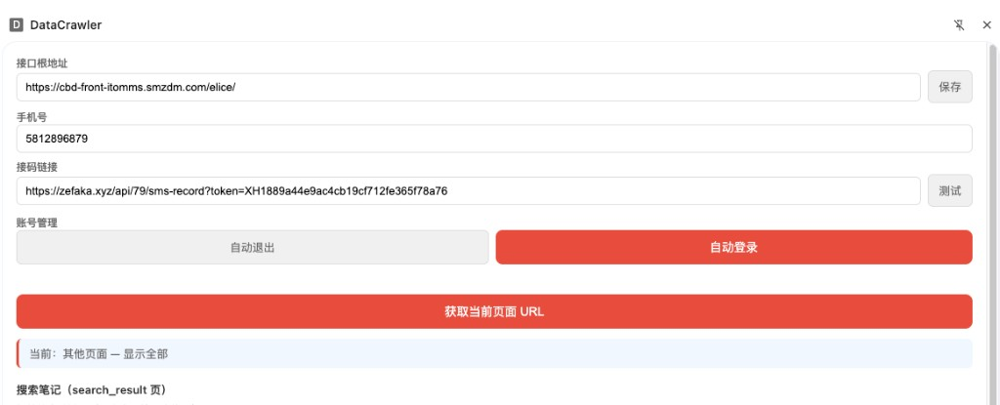
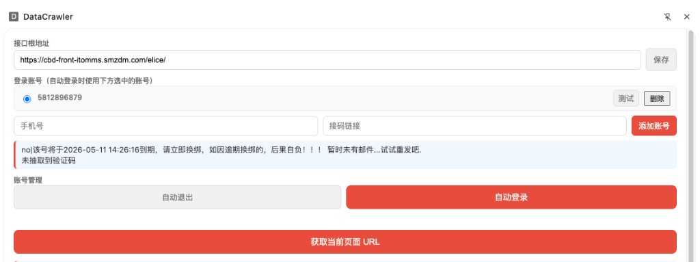
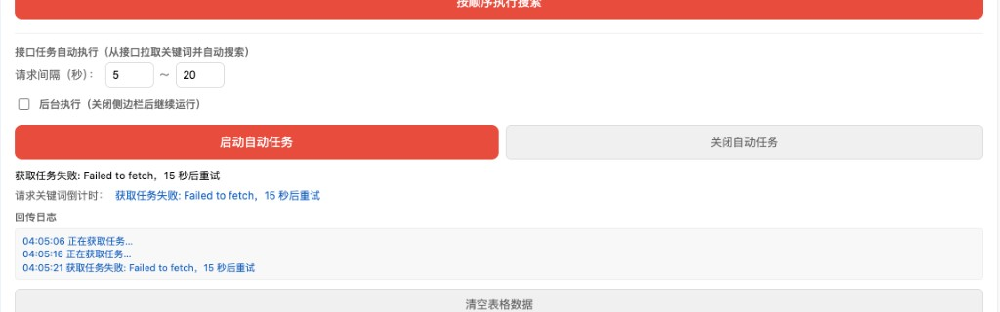

# 提示词记录 — 2026-03-14

## 会话 1: rednote 跳转兼容 (02:34~02:38)

1. `≈02:34` @xhs_extension_spider.py 由于国内IP,再跳转rednote.com的时候,会跳转到xiaohongshu.com,通过bat命令需要两次打开URL网址

## 会话 2: 多账号管理 (03:22~04:16)

1. `03:21` 浏览器插件支持设置多个账号,但是当前自动登录的时候智能选择一个账号登录,通过单选按钮选择

   

2. `03:28` 同时接码链接也展示出来

   

3. `03:29` 

   

4. `≈03:36` 显示全

5. `≈03:44` 自动登录启动后, 启动自动任务

6. `≈03:51` 记录到合适的md

7. `≈03:58` 打包

8. `04:05` 

   

9. `≈04:09` 修复是不是有问题了

10. `≈04:12` 打包

11. `≈04:16` 登录账号能否记录到浏览器本地, 即使插件卸载后再重装也能恢复过来
