# 提示词记录 — 2026-03-19

## 会话 1: 数据回传的时候同步知道当前关键词是多少,而且这个关键词是从请... (10:14~10:51)

1. `10:15` 数据回传的时候同步知道当前关键词是多少,而且这个关键词是从请求链接请求头拦截抽取的
同时回传给服务器的是这个关键词应该是从拦截请求头抽取的,
防止搜索的词和拦截的词回传不一致

   

2. `10:22` 将对比结果同时回传到插件日志窗口

   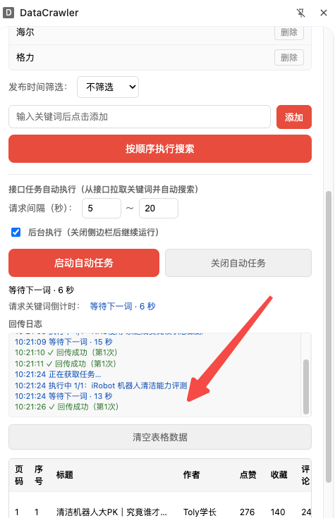

3. `10:28` 还有个问题, 浏览器拦截数据包可能由于浏览器窗口比较小,搜索采集只拦截到了第一页数据,未自动拦截到第二页数据;
目前解决方案是缩小浏览器, 但是增加运维困难,浏览器缩小方案非常不智能;
现在需求是每个关键词要采集两页数据, 解决方式是如果第二页采集未自动拦截则让浏览器向下滑动触发第二页请求

   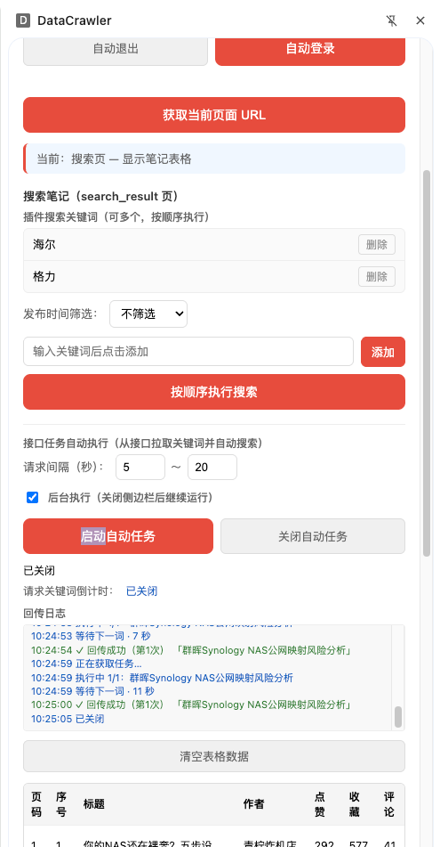

4. `≈10:32` 目前方案如果搜索直接就触发了第二页请求还会启动滚动流程吗?

5. `≈10:36` 同时在插件日志回传中显示页码,这个页码也应该是从搜索请求头抽取的

6. `≈10:39` 好的,完成的很好
现在我要把今天前面的修改记录日报,请帮我总结

7. `≈10:43` 好记录日报到docs文件夹下面,文件名称自行设计

8. `≈10:46` 同时在日报最后增加一个总结:
提炼上面主要解决内容, 语句精炼, 注意你的回报对象是公司创始人

9. `10:50` 日志回传窗口 提示回传成功(第1次)
这个第1次感觉没用

   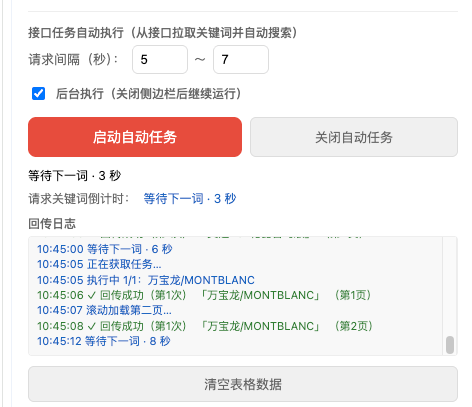

10. `≈10:51` ok

## 会话 2: 你好,你是新的会话,你知道另外一个chat问的问题吗 (10:52~11:00)

1. `≈10:52` 你好,你是新的会话,你知道另外一个chat问的问题吗

2. `≈11:00` 好的 , 我想做个功能
1. 统计每日的我发给你你对当前项目的修改的提示词并记录到当天文件中,方便后续整理
2. 做日报功能,就是刚才让你做,想做成智能化自动化流程
3. 上面统计提示词和日报功能,设计成什么形式比较好? skill? 
4. 你可以帮我实现吗?
5. 实现后我如何操作?

## 会话 3: 生成日报 (11:29~11:59)

1. `≈11:29` 生成日报

2. `≈11:32` 记录提示词没有图片吗?

3. `≈11:34` 是的

4. `≈11:37` 这个日报skill消耗token多吗?

5. `≈11:39` 提示词记录 能展示下提示词调用的时间吗?

6. `≈11:41` 如果 日志生成 执行多次 changelog 修改日报文件,每次都重新生成还是追加?

7. `≈11:44` 追加模式 最终效果?

8. `≈11:46` 这样有什么缺点

9. `≈11:49` 全量生成的好处和坏处

10. `≈11:51` git log 改成它和原来对别

11. `≈11:54` 需要实现这个改动

12. `≈11:56` 现在能生成昨日的历史日报吗?

13. `≈11:59` 把这些日期日报都补上吧

## 会话 4: 提交git 并push 自动添加更新评论 (13:27~13:28)

1. `≈13:27` 提交git 并push 自动添加更新评论

## 会话 5: 现在增加一个多账号采集能力: 1. 每个账号增加一个设置最大... (14:32~21:16)

1. `14:38` 现在增加一个多账号采集能力:
1. 每个账号增加一个设置最大采集次数的设置默认10,需要持久化到插件存储
2. 按天维度计算,当天达到最大采集次数后不再采集, 然后走自动退出逻辑, 切换到另外一个账号采集, 切换的时候账号单选按钮要自动切换
3. 当达到最后一个账号的如果再切换的话继续从第一个账号开始切换
要求:
1. 这整个过程要全自动化
2. 账号切换的时候自动退出到第二个账号自动登录间隔10秒
3. 检测下一个账号的是也要记录当前账号当天是否超过最大采集次数如果超过了当天就不再采集
4. 第二天所有采集次数重新计算, 设计时候最好不要清掉昨天的采集次数
5. 日志采集的时候要打印当天累计采集了多少次

   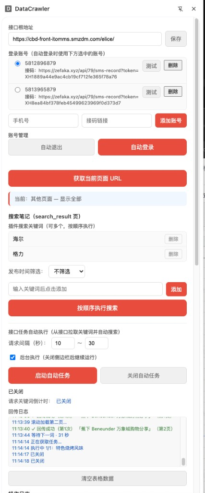

2. `14:49` 执行搜索后今日采集 次数为啥没加1,请优化

   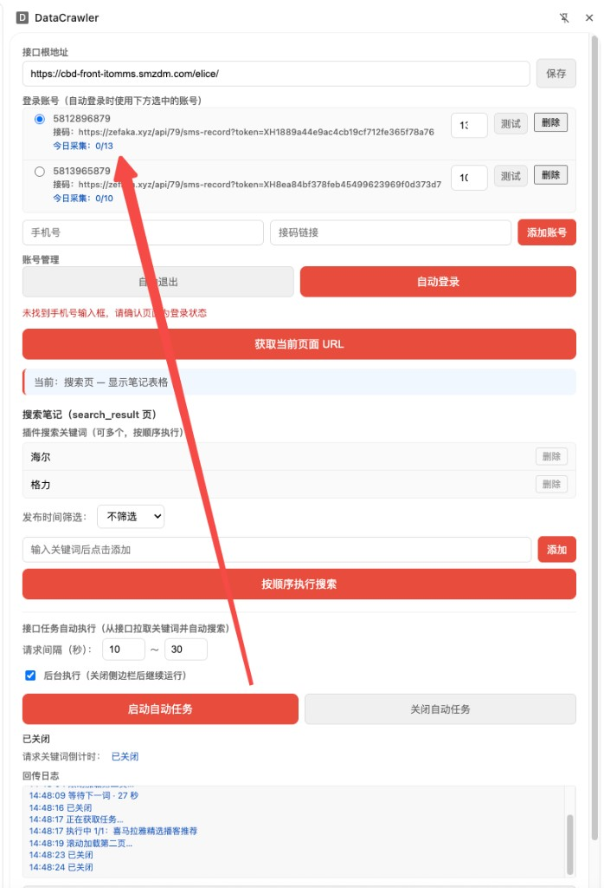

3. `≈14:54` 实现逻辑应该是这样是不是比较好:
1. 只要数据回传(第一页成功就+1)
现在是不是真实现的

4. `≈14:58` 切换自动登录的时候应该使用rednode.com 小红书国际域名

5. `15:03` 当所有账号都达到当天最大采集次数的时候, 应该继续循环检测当前时间所有账号状态,并打印检测日志而不是现在关闭自动任务,目的是如果过了今天到0晨可以自动实现第二天的持续采集

   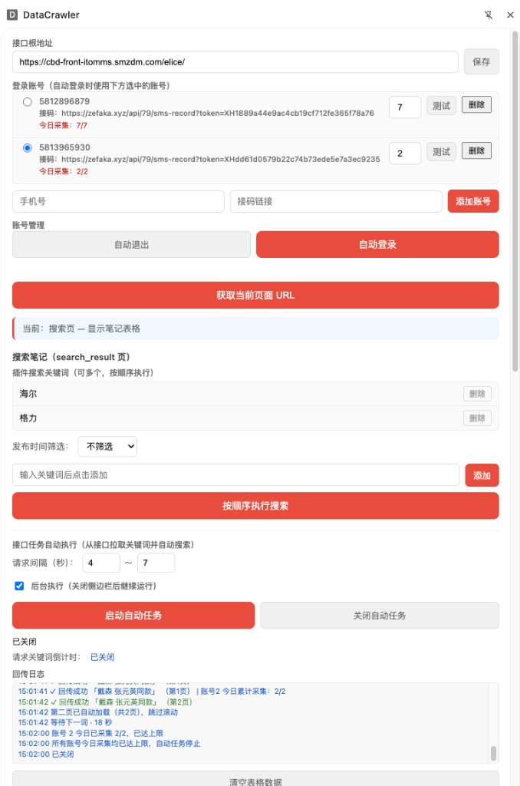

6. `≈15:05` 别60秒15秒吧

7. `15:07` 在此15秒后,任务是启动了但是没有拦截到搜索接口

   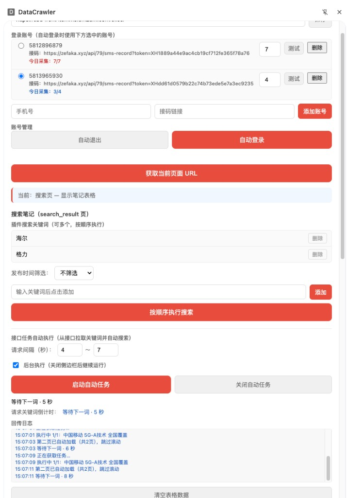

8. `≈15:12` 还是不对,我是修改了代码然后,在插件页面重新加载了, 在搜索页面关闭了插件侧边栏然后再打开直接点启动搜索,这时候是不是注入失败了?

9. `≈15:17` 提交git

10. `15:21` 字的输入框宽一些
默认值200

   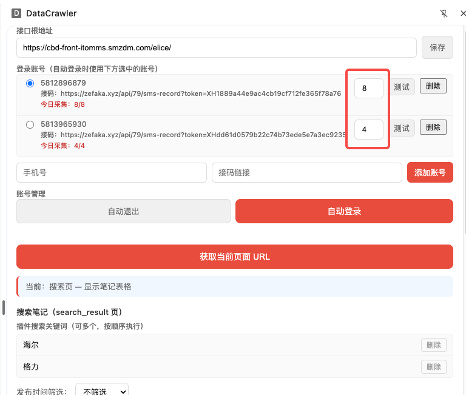

11. `15:27` 输入框还是很窄

   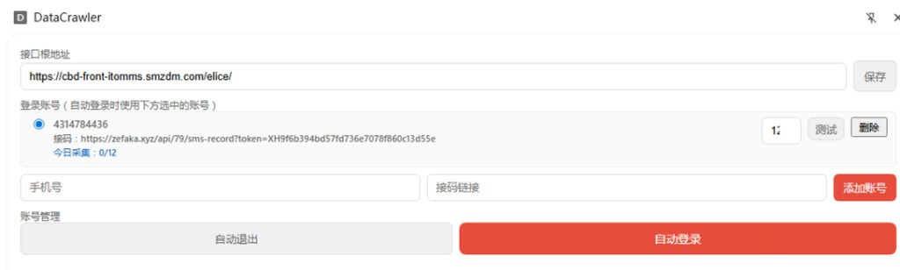

12. `15:32` 这个截图搜索结果是被安全限制了, 未找到搜索框逻辑, 最终走关闭自动任务,不对
应该出现账号被封,该账号应该今日暂停采集, 今日采集数量等于今日最大采集数量,走切换账号逻辑

   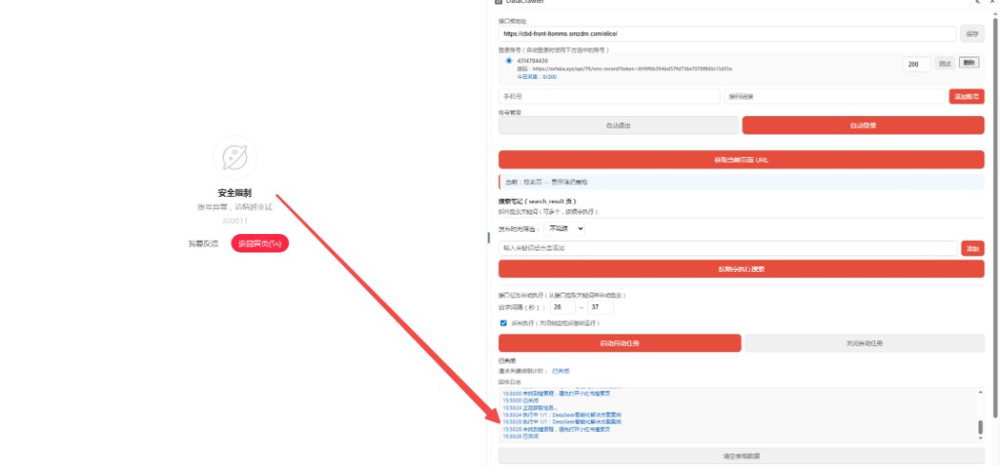

13. `≈15:39` git push代码

14. `15:46` 输入账号的时候,
我从账号系统复制过来的是:
7534788611	https://zefaka.xyz/api/668/sms/by_key?key=815fc3704ed2492ea197ba12ddab15c3
7534788612	https://zefaka.xyz/api/668/sms/by_key?key=957c688cdfa545caae95fcd58f36bff4
请帮我设计功能可以自动添加多个账号

   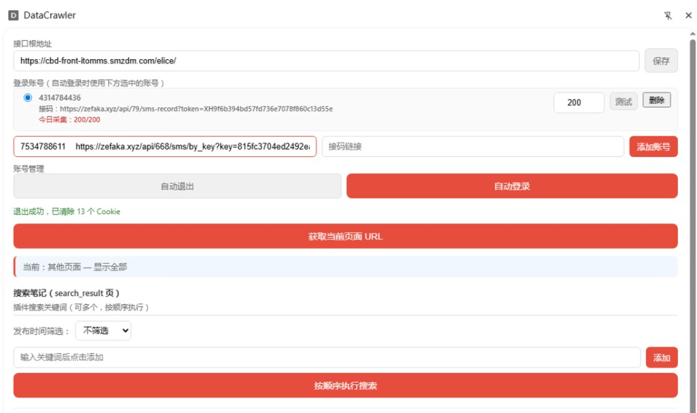

15. `≈17:00` {"code":0,"msg":"success","data":{"message_type":"SMS","description":"","fields":{"content":"Your verification code is: 132578."},"key_expiration_time":"2026-04-15T00:00:00"}}

验证码抽取 错了"code":0, 是错了

16. `≈18:14` 检查下是不是这个逻辑并修复: 账号达到单日采集数量后自动切换其他账号自动登录时候 关闭自动任务, 登录成功后开启自动任务

17. `≈19:27` 账号切换期间自动任务保持运行状态? 那岂不是页面在动你能自动登录?

18. `20:41` 增加一个功能,当页面出现登录框的时候, 当前选中的账号是什么执行账号自动登录

   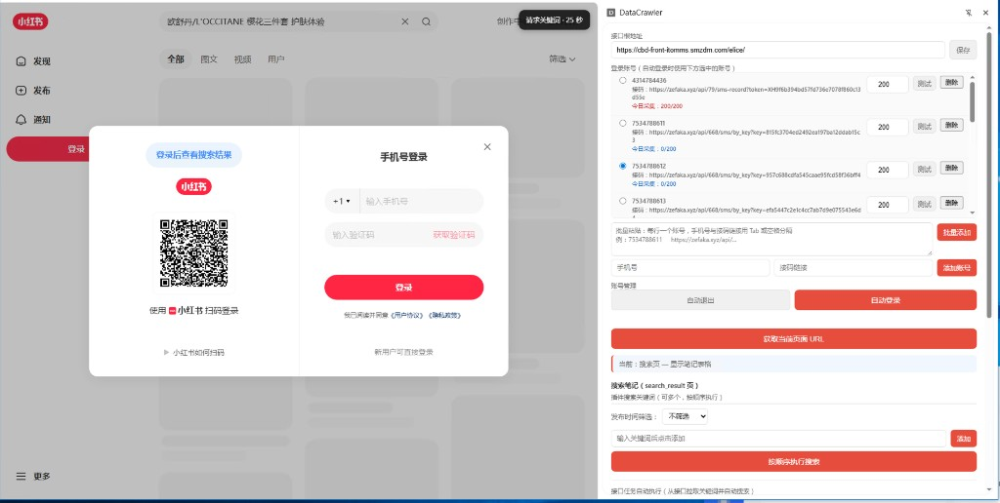

19. `≈20:48` 验证码抽取正则表达式统一为 code is: 1234

20. `≈20:55` 检查,任何登录成功后自动启动任务

21. `≈21:02` 提交git ,自动给备注

22. `≈21:09` 在自动任务执行过程中如果出现手机号登录框, 则执行自动登录任务;

但是也有可能误判, 是未加载完全导致登录框出现;

这时候如果执行自动登录时候, 如果刷新页面显示自动登录已经成功了,则算登录成功继续启动自动任务

23. `≈21:16` 提交git ,自动评论

## 会话 6: 我现在mac磁盘满了,请分析我的磁盘可以删除的文件或者目录 (17:47~17:50)

1. `≈17:47` 我现在mac磁盘满了,请分析我的磁盘可以删除的文件或者目录

## 会话 7: 你说 这是什么值得买科技 第二次 值得买 Ideathon ... (19:34~19:55)

1. `19:34` 你说
这是什么值得买科技 第二次 值得买 Ideathon Hub 比赛;

赛事介绍:

这里是你获取ideathon赛事一手消息、寻找组队CP、交流创意的专属空间！群内将实时同步最新赛况、培训资源和所有官方资料。期待与每一位创造者一起，在这场技术盛宴中玩出精彩，共同定义未来！

我们参赛队伍部门:

集团数据部-逆向采集部门
集团数据部-数据采集研发部

帮我们想起个炫酷队名,并说明原因, 快! 提交时间要到了

   
   

2. `≈19:36` 重新回答上面问题

3. `≈19:39` 重新回答上面问题

4. `≈19:42` 重新回答上面问题

5. `≈19:44` 重新回答上吗问题

6. `≈19:47` 重新回答上门体

7. `≈19:49` @img_v3_02vu_760e56fa-242e-4662-9152-ea8cc9541f3g.jpg 中奖女生在高一点,对齐

8. `≈19:52` 好生成新的

9. `≈19:55` 什么玩意
